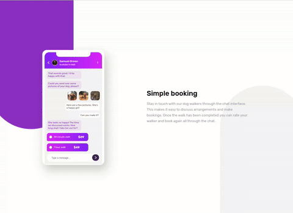

# Frontend Mentor - Chat app CSS illustration

## Bem Vindo! 👋

Obrigado por ver a solução para o desafio front-end.

Esta é uma solução para o [Frontend Mentor -Chat app CSS illustration](https://www.frontendmentor.io/challenges/chat-app-css-illustration-O5auMkFqY). Os desafios do Frontend Mentor ajudam você a melhorar suas habilidades de codificação construindo projetos realistas.

**To do this challenge, you need a strong understanding of HTML and CSS.**

## Construido com

### Construído com

- HTML5
- CSS
- CSS flex

- Veja o layout ideal para o componente dependendo do tamanho da tela do dispositivo

- Website - [Vinícius Mendes Lima](https://viniciusml.vercel.app/)
- Frontend Mentor - [@ViniciusMendesLima](https://www.frontendmentor.io/profile/ViniciusMendesLima)
- Linkedin - [Vinícius Mendes Lima](www.linkedin.com/in/vinicius-mendes-lima)